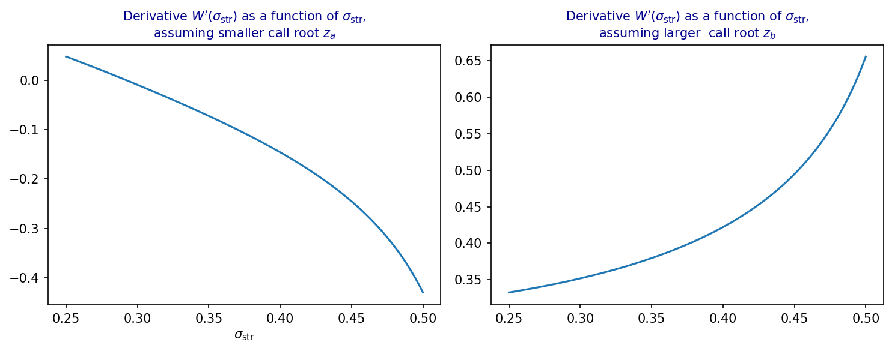

# Premium-Adjusted Forward Delta Inversion

> Python implementation for the inversion of premium-adjusted forward delta, as described
> in the paper "Analysis of volatility strangles via normalizing volatility transforms".

---

## Overview

This repository illustrates Python implementation for the numerical methods, accompanying 
the paper:

> **Analysis of volatility strangles via normalizing volatility transforms** by Vladimir Lucic, David Belay and Parviz Rakhmonov  
> [Journal / SSRN link — to be added]

The theoretical development is presented in the paper itself. This repository focuses on reproducible
numerical validation of the analytical results.

---

## Repository Structure

```
├── delta_inversion.py   # Core numerics: Basic implementation of Mills ratio, normal CDF, Delta inversion
├── paper_plots.py       # Unit tests, demonstrating inversion of premium-adjusted delta
└── README.md
```

### `delta_inversion.py`

Core module implementing:

- **`z_prem_adj`** — inversion of premium-adjusted forward delta $\Delta^{pa,F}$ to recover log-moneyness $z$ for a given
  Delta and total volatility using bracketing and bisection
- **`delta_prem_adj`** — premium-adjusted forward delta $\Delta^{pa,F}$ for call and put options
- **`R` / `R_inv`** — Mills ratio $R(x) = \frac{1-N(x)}{n(x)}$ and its inverse $R^{-1}$
<!-- - **`norm_cdf` / `inv_normal_cdf`** — standalone implementation of normal CDF and its inverse via Hart's rational approximation -->


### `paper_plots.py`

Numerical tests and diagnostic figures. Run the full suite with:

```bash
python paper_plots.py
```

---

## Tests and Figures

### `test_delta_inv`

Verifies the accuracy of the delta inversion for a fixed forward delta across 
total-volatility levels of $[0.001, 1.0]$. For each volatility level, we solve
$z$ from the relationship $\Delta^{pa,F}(z) = \Delta$ for both calls and puts, 
then check that re-evaluating the forward delta recovers $\Delta$ to within 
tolerance $\varepsilon$.

### `test_delta_prem_adj`
An accuracy test over a grid of time-to-expiry values $T \in \{1/365,\, 1/12,\, 1,\, 10\}$ (years), annualised volatility levels (linearly spaced in $[0.01, 5.0]$), and delta levels 
(log-spaced in $[10^{-4}, 0.5]$).
For each feasible $(w, \Delta)$ pair the test inverts the premium-adjusted delta
to obtain log-moneyness $z$ and checks that we recover the input delta $\Delta$ within a
given tolerance. Feasibility is non-trivial for calls due to the existence of a 
maximum delta $\Delta_{max}$. Infeasible cases (where inversion returns `nan`) are skipped.

In addition to the pass/fail assertion, the test benchmarks the inversion at the requested
tolerance against a high-precision reference tolerance $10^{-12}$ and returns the RMSE
of the log-moneyness error separately for calls and puts .

### `test_delta_prem_rmse`
Reproduction of Table 1. This is test is a convenience wrapper that calls 
`test_delta_prem_adj` at three tolerance levels ($10^{-6}$, $10^{-8}$, $10^{-9}$) 
and collects the RMSE results into a summary table, allowing a quick assessment of the 
accuracy–speed trade-off of the bisection solver.

### `test_delta_max`
Stress-tests delta inversion in the neighbourhood of the 
maximum attainable call delta $\Delta_{max}$, where the forward delta function is 
almost flat and inversion becomes numerically challenging. For each $(\sigma, T)$ pair, 
the test computes

$$z_{max} = \overline\sigma\cdot\left(R^{-1}\left(\tfrac{1}{\overline\sigma}\right) - \tfrac{\overline\sigma}{2}\right), \qquad \Delta_{max} = \Delta^{pa,F}(\overline\sigma,\, z_{max})$$

where $\overline\sigma=\sigma\sqrt{T}$ and and then inverts $\Delta = \alpha\times\Delta_{max}$ for 
$\alpha \in \{0.99, 0.999, 0.9999\}$.

Each inversion is checked for finiteness and for recovery of $\Delta$ within the requested
tolerance, and the RMSE against a $10^{-12}$ benchmark is returned.

### `test_delta_max_neighbourhood`
Reproduction of Table 2. A convenience wrapper that calls `test_delta_max` at three 
tolerance levels ($10^{-6}$, $10^{-8}$, $10^{-9}$) and collects the RMSE results into 
a summary table, providing a targeted assessment of near- $\Delta_{max}$ accuracy.

### `plot_prem_adj_delta`
Produces a two-panel figure assuming total volatility $\overline\sigma = \sigma\sqrt{T}$ with
$\sigma = 0.15$ and $T = 2$ years:
- **Left panel**: premium-adjusted forward delta $\Delta^{pa,F}$ as a function of log-moneyness $z$.
  The horizontal line marks the maximum attainable delta $\Delta_{max}$, and the vertical line marks
  the corresponding log-moneyness $z_{max}$. For call options, delta inversion is only defined
  for $\Delta < \Delta_{max}$.
- **Right panel**: the inverse map $z(\Delta^{pa,F})$, i.e. log-moneyness as a function of
  premium-adjusted delta, over the feasible delta range $(0, \Delta_{max})$.


### `plot_W_deriv`
Produces a two-panel figure assuming $T = 6$ and $\Delta=0.25$ years:
- **Left panel**: Sensitivity of strangle premium $V_{\sigma_{\matrm{str}}}$ as a function of
  stangle volatility $\sigma_{\matrm{str}}$, when we chose a smaller root $z_a$ in delta-to-strike
  conversion
- **Right panel**: Sensitivity of strangle premium $V_{\sigma_{\matrm{str}}}$ as a function of
  stangle volatility $\sigma_{\matrm{str}}$, when we chose a larget root $z_b$ in delta-to-strike
  conversion


---

## Installation

Clone the repository and install dependencies:

```bash
git clone https://github.com/ParvizRZ/FxStranglesNVT.git
cd FxStranglesNVT
pip install numpy matplotlib
```

### Dependencies

- `python >= 3.10`
- `numpy >= 1.22`
- `matplotlib >= 3.5`

---

## Citation

If you use this code in your research, please cite:

```bibtex
@article{lucic_belay_rakhmonov_2026,
  title   = {Analysis of volatility strangles via normalizing volatility transforms},
  author  = {Lucic, Vladimir and Belay, David and Rakhmonov, Parviz},
  year={2026},
  note={Working paper},
  url={[URL]}
}
```

---

<!-- ## License

[To be added]
-->
