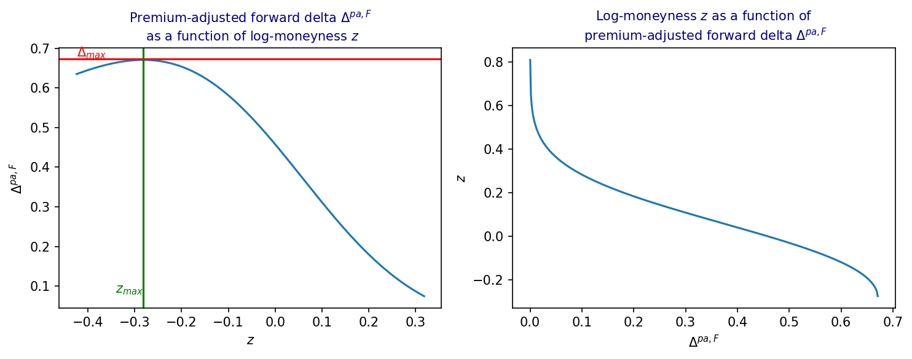

# Premium-Adjusted Forward Delta Inversion

> Python implementation for the inversion of premium-adjusted forward delta, as described
> in the accompanying paper.

---

## Overview

This repository illustrates Python implementation for the numerical methods, accompanying 
the paper:

> **Analysis of volatility strangles via normalizing volatility transforms** by Vladimir Lucic, David Belay and Parviz Rakhmonov  
> [Journal / SSRN link — to be added]

The theoretical development is presented in the paper itself. This repository focuses on reproducible
numerical validation of the analytical results.

---

## Repository Structure

```
├── delta_inversion.py   # Core numerics: Basic implementation of Mills ratio, normal CDF, Delta inversion
├── paper_plots.py       # Unit tests and figures, reproducing paper results
└── README.md
```

### `delta_inversion.py`

Core module implementing:

- **`z_prem_adj`** — inversion of premium-adjusted forward delta $\Delta^{pa,F}$ to recover log-moneyness $z$ for a given
  Delta and total volatility using bracketing and bisection
- **`delta_prem_adj`** — premium-adjusted forward delta $\Delta^{pa,F}$ for call and put options
- **`R` / `R_inv`** — Mills ratio $R(x) = \frac{1-N(x)}{n(x)}$ and its inverse $R^{-1}$
<!-- - **`norm_cdf` / `inv_normal_cdf`** — standalone implementation of normal CDF and its inverse via Hart's rational approximation -->


### `paper_plots.py`

Numerical tests and diagnostic figures. Run the full suite with:

```bash
python paper_plots.py
```

---

## Tests and Figures

### `test_delta_inv`

Verifies the accuracy of the delta inversion for a fixed forward delta across 
total-volatility levels of $[0.001, 1.0]$. For each volatility level, we solve
$z$ from the relationship $\Delta^{pa,F}(z) = \Delta$ for both calls and puts, 
then check that re-evaluating the forward delta recovers $\Delta$ to within 
tolerance $\varepsilon$.

### `test_delta_prem_adj`

A comprehensive accuracy test over the range of total volatility levels (log-spaced in $[10^{-3}, 2]$)
and various delta levels (log-spaced in $[10^{-4}, 0.5]$). For each feasible $(w, \Delta)$ pair —
feasibility is non-trivial for calls due to the existence of a maximum delta $\Delta_{max}$ —
the test inverts the premium-adjusted delta to obtain log-moneyness $z$ and checks that we 
recover the input Delta $\Delta$ within given tolerance. Infeasible cases (where inversion returns `nan`)
are skipped. This stress test covers deep out-of-the-money and near-at-the-money options,
as well as very low and very high volatility regimes.

### `plot_prem_adj_delta`

Produces a two-panel figure assuming total volatility $\bar\sigma = \sigma\sqrt{T}$ with
$\sigma = 0.15$ and $T = 2$ years:

- **Left panel**: premium-adjusted forward delta $\Delta^{pa,F}$ as a function of log-moneyness $z$.
  The horizontal line marks the maximum attainable delta $\Delta_{max}$, and the vertical line marks
  the corresponding log-moneyness $z_{max}$. For call options, delta inversion is only defined
  for $\Delta < \Delta_{max}$.

- **Right panel**: the inverse map $z(\Delta^{pa,F})$, i.e. log-moneyness as a function of
  premium-adjusted delta, over the feasible delta range $(0, \Delta_{max})$.



---

## Installation

Clone the repository and install dependencies:

```bash
git clone https://github.com/ParvizRZ/FxStranglesNVT.git
cd FxStranglesNVT
pip install numpy matplotlib
```

### Dependencies

- `python >= 3.10`
- `numpy >= 1.22`
- `matplotlib >= 3.5`

---

## Citation

If you use this code in your research, please cite:

```bibtex
@article{lucic_belay_rakhmonov_2026,
  title   = {Analysis of volatility strangles via normalizing volatility transforms},
  author  = {Lucic, Vladimir and Belay, David and Rakhmonov, Parviz},
  year={2026},
  note={Working paper},
  url={[URL]}
}
```

---

## License

[To be added]
